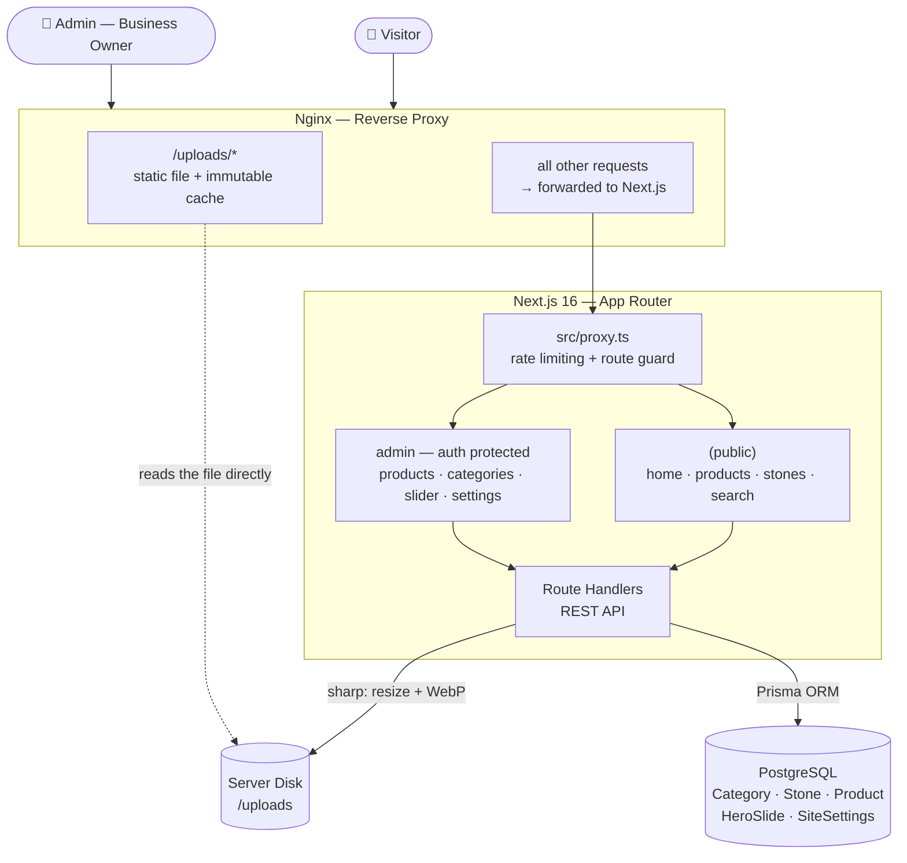

# Nymu Aksesuar — Natural Stone & Pearl Jewelry E-Commerce Showcase

[nymuaksesuar.com](https://nymuaksesuar.com)

[🇹🇷 Türkçe versiyon](README.md)

An end-to-end Next.js application built for a natural stone and pearl jewelry workshop,
consisting of a **product catalog + WhatsApp order flow + a fully manageable admin panel**.
There's no cart/payment infrastructure — the goal is a digital showcase: customers discover a
product and reach the workshop directly via "Ask on WhatsApp".

**Developer:** Furkan Turan — solo end-to-end development, from design to database schema,
admin panel, and server deployment.

---

## ⚠️ About This Repo

This repository is **for portfolio/showcase purposes only**. The project's source code is
**not shared**, due to the client's data and real admin panel access. Here you'll only find
the system's architecture, the technologies used, the problems solved, and screenshots of
the interface.

---

## Problem & Solution

Small-scale workshops producing handmade natural stone/pearl jewelry usually showcase their
products only on Instagram, in a scattered way — no category/filtering, product information
gets lost in comments, and updating stock/price means deleting and re-uploading a post. A
real e-commerce infrastructure (cart, payment), on the other hand, is both unnecessary at
this scale and incompatible with the business's preferred "sell by talking it through on
WhatsApp" model.

This project offers a solution in between: an SEO-friendly, fast **product showcase**
filterable by category and natural stone, plus an **admin panel** the business owner can
manage entirely on their own — adding/removing products, editing the homepage slider,
changing site settings, all without touching code. Once a customer decides they're
interested, one tap sends them to the workshop via a WhatsApp message pre-filled with the
product info.

---

## Modules

| Module | What it does |
|---|---|
| **Homepage** | Auto-playing video/image hero slider, category showcase, featured/special-collection/new-arrival product carousels, Instagram & Shopier gallery |
| **All Products** | Hierarchical category filtering (parent category → subcategory), "New Arrivals" filter, pagination |
| **Product Detail** | Multi-image gallery (pinch-zoom + lightbox), cross-link to the stone it's made of, wrist-size guide, WhatsApp and Shopier CTAs |
| **Natural Stones** | Stone library — each stone's properties + every product made with it |
| **Search** | Turkish-character-aware (İ/ı, Ş/ş, Ğ/ğ) live search, results page |
| **Admin — Products** | CRUD, multi-image upload (drag & drop, automatic compression), featured/new/special-collection tags |
| **Admin — Categories & Stones** | Unlimited-depth category hierarchy, stone library management |
| **Admin — Homepage Slider** | Image/video slide management, title/subtitle/font selection |
| **Admin — About Page** | The entire page content (headings, values, philosophy text) is editable from the admin panel |
| **Admin — Settings** | Phone/email/WhatsApp/Instagram info, site-wide font selection |
| **Admin — Authentication** | Email/password login, failed-attempt counter + automatic account lockout |

---

## Screenshots

### Admin Panel

---

## Tech Stack

**Frontend**
- **Next.js 16 (App Router)** + **React 19.2** + **TypeScript** — server components,
  Server Actions, page transition animations via the native React `ViewTransition` API
- **Tailwind CSS v4**
- **shadcn/ui** — built on [Base UI](https://base-ui.com) primitives (the newer alternative
  to Radix, from the same team)
- **Zod** — form and API input validation
- **NextAuth.js (Credentials Provider)** — admin session management (JWT strategy)

**Backend & Data**
- **PostgreSQL** + **Prisma ORM** — type-safe queries, migration history
- Hierarchical `Category` model (self-relation, unlimited depth)
- Route Handler-based REST API layer (`/api/products`, `/api/categories`,
  `/api/hero-slides`, `/api/search`, `/api/upload`, ...)
- **sharp** — every uploaded image is resized and converted to WebP server-side; video
  uploads are validated by file signature (magic bytes)

**Infrastructure & Security**
- **VPS + Nginx (reverse proxy) + PM2** — self-hosted, no dependency on third-party services
- Images are kept on the server's disk; Nginx serves them directly with
  `Cache-Control: immutable` (the Next.js process isn't hit on every request)
- A custom **proxy layer** (`src/proxy.ts`) handles IP-based rate limiting (general API +
  a stricter auth limit) and login/redirect control
- Strict **Content-Security-Policy**, HSTS, X-Frame-Options, and Permissions-Policy headers
- Failed-attempt counter with automatic account lockout on admin login; a constant delay is
  applied even for non-existent emails (preventing user-enumeration via timing attacks)
- **ISR (Incremental Static Regeneration)** — changes made in the admin panel appear on the
  public site within seconds, without every request hitting the database

---

## Architecture

---

## Notable Technical Points

- **Turkish-aware search:** Postgres's `ILIKE` matching isn't reliable for Turkish
  case-folding (the "İ"/"i" vs "I"/"ı" distinction means a search for "yüzük" won't match
  "YÜZÜK") — so comparison is delegated not to DB collation, but to V8's `tr-TR`
  locale-aware `toLocaleLowerCase`.
- **Custom rate limiter:** Without relying on an external service (Upstash, Cloudflare,
  etc.), an in-memory bucket algorithm applies separate limits to general API and auth
  endpoints.
- **Video autoplay safety net:** Mobile browsers can silently block autoplay (data saver
  mode, low power mode) — if `play()` is rejected, the slider automatically advances to the
  next slide instead of getting stuck on an endless black screen.
- **Upload-time image/video validation:** Instead of trusting the MIME type, the file format
  is verified from the file's actual bytes (magic bytes).
- **Admin-managed typography:** Each title/subtitle on the homepage slider has its own font
  choice, drawn from a font library optimized at build time via `next/font/google`.
- **Hierarchical category system:** A self-relation enables unlimited-depth parent/child
  category structure — product filtering works against both a category itself and all its
  subcategories.
- **Native React View Transitions:** Smooth, browser-level transition animations on page
  navigation and while the product grid loads, using React 19's experimental
  `<ViewTransition>` component.

---

## Contact

Feel free to reach out for a similar project or collaboration.

**Furkan Turan** — *Full-stack Developer*
