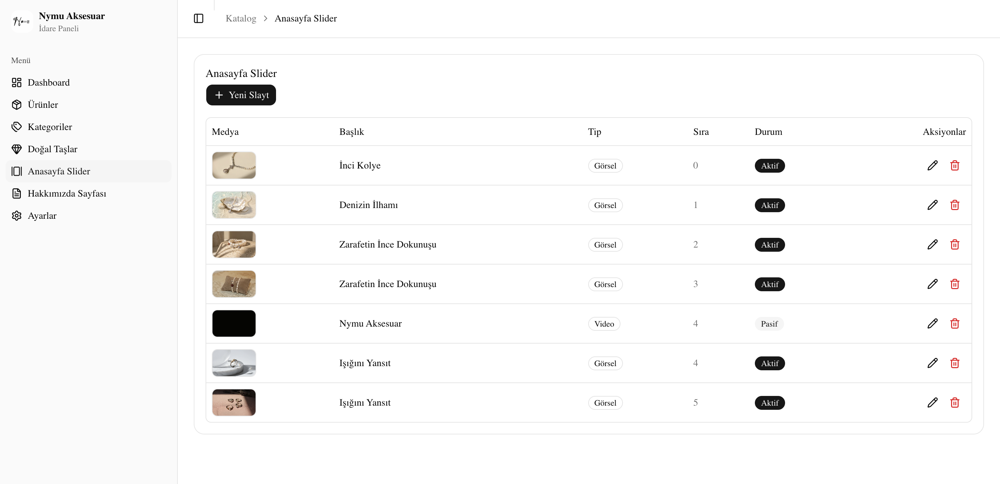
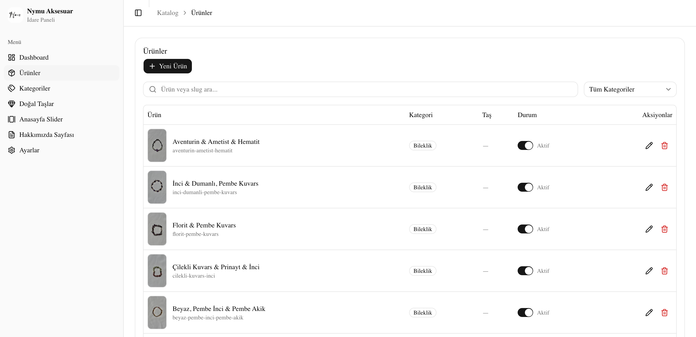
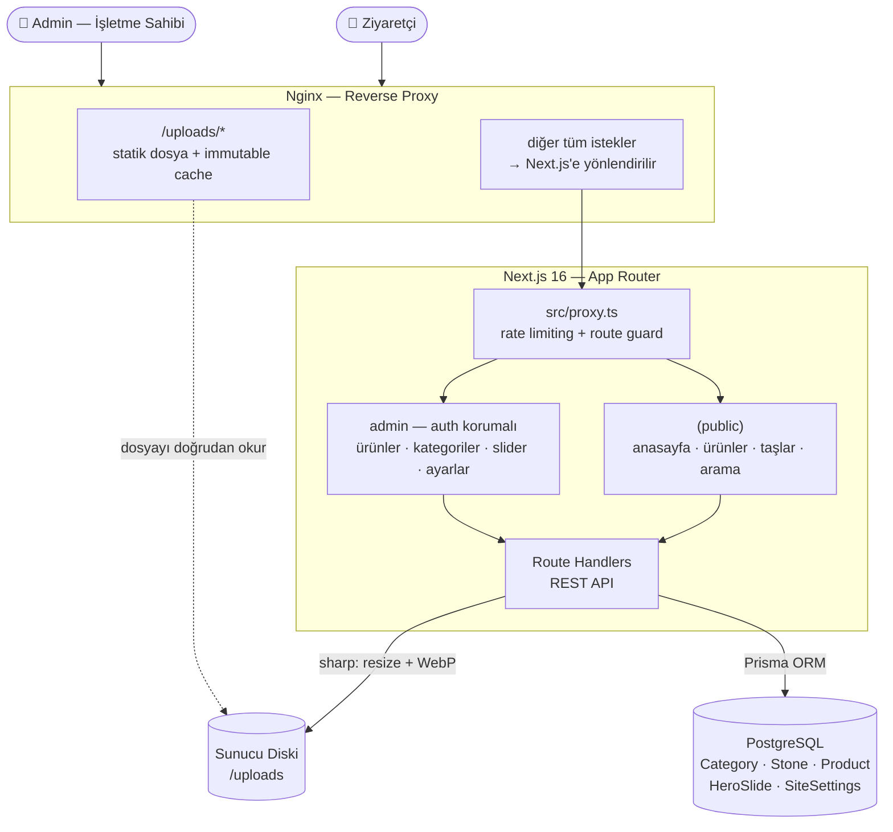

# Nymu Aksesuar — Doğal Taş & İnci Takı E-Ticaret Vitrini

[nymuaksesuar.com](https://nymuaksesuar.com)

[🇬🇧 English version](readme.en.md)

Doğal taş ve inci takı üreten bir atölye için geliştirilmiş, **ürün kataloğu + WhatsApp
sipariş akışı + tam yönetilebilir bir admin paneli**nden oluşan uçtan uca bir Next.js
uygulaması. Ödeme/sepet altyapısı yok — amaç dijital bir vitrin: müşteri ürünü keşfeder,
"WhatsApp'tan Sor" ile atölyeyle doğrudan iletişime geçer.

**Geliştirici:** Furkan Turan — tasarımdan veritabanı şemasına, admin paneline ve sunucu
deploy sürecine kadar tek kişilik uçtan uca geliştirme.

---

## ⚠️ Bu Repo Hakkında

Bu depo **yalnızca portfolyo/tanıtım amaçlıdır**. Projenin kaynak kodu, müşteri verileri ve
gerçek yönetim paneli erişimi nedeniyle **paylaşılmamaktadır**. Burada yalnızca sistemin
mimarisi, kullanılan teknolojiler, çözülen problemler ve arayüzden ekran görüntüleri yer alır.

---

## Problem & Çözüm

El yapımı doğal taş/inci takı üreten küçük ölçekli atölyeler genellikle ürünlerini yalnızca
Instagram üzerinden, dağınık bir şekilde sergiliyor — kategori/filtreleme yok, ürün bilgisi
yorumlarda kayboluyor, stok/fiyat güncellemesi paylaşım silip yeniden yüklemek anlamına
geliyor. Gerçek bir e-ticaret altyapısı (sepet, ödeme) ise bu ölçekte hem gereksiz hem de
işletmenin tercih ettiği "WhatsApp'tan görüşerek satış" modeliyle uyumsuz.

Bu proje, ikisinin ortasında bir çözüm sunuyor: SEO'ya uygun, hızlı, kategorilere ve doğal
taşlara göre filtrelenebilir bir **ürün vitrini** + işletme sahibinin tek başına
yönetebileceği bir **admin panel** — kod bilmeden ürün ekleme/çıkarma, anasayfa
slider'ını düzenleme, site ayarlarını değiştirme. Satın alma niyeti oluşunca müşteri tek
tıkla, ürün bilgisi otomatik doldurulmuş bir WhatsApp mesajıyla atölyeye yönleniyor.

---

## Modüller

| Modül | Ne yapıyor |
|---|---|
| **Anasayfa** | Otomatik oynatan video/görsel hero slider, kategori vitrini, öne çıkan/özel koleksiyon/yeni ürün karuselleri, Instagram & Shopier galerisi |
| **Tüm Ürünler** | Hiyerarşik kategori filtreleme (üst kategori → alt kategori), "Yeni Gelenler" filtresi, sayfalama |
| **Ürün Detay** | Çoklu görsel galerisi (pinch-zoom + lightbox), taş bilgisi çapraz linki, bilek ölçüsü rehberi, WhatsApp ve Shopier CTA'ları |
| **Doğal Taşlar** | Taş kütüphanesi — her taşın özellikleri + o taşla üretilmiş tüm ürünler |
| **Admin — Ürünler** | CRUD, çoklu görsel yükleme (sürükle-bırak, otomatik sıkıştırma), öne çıkan/yeni/özel koleksiyon etiketleri |
| **Admin — Kategoriler & Taşlar** | Sınırsız derinlikte kategori hiyerarşisi, taş kütüphanesi yönetimi |
| **Admin — Anasayfa Slider** | Görsel/video slayt yönetimi, başlık/alt başlık/font seçimi |
| **Admin — Hakkımızda Sayfası** | Sayfa içeriğinin tamamı (başlıklar, değerler, felsefe metni) admin'den düzenlenebilir |
| **Admin — Ayarlar** | Telefon/e-posta/WhatsApp/Instagram bilgileri, site geneli font seçimi |
| **Admin — Kimlik Doğrulama** | E-posta/şifre girişi, başarısız deneme sayacı + otomatik hesap kilitleme |

---

## Ekran Görüntüleri

### Admin Panel

---

## Teknoloji Yığını

**Frontend**
- **Next.js 16 (App Router)** + **React 19.2** + **TypeScript** — sunucu bileşenleri,
  Server Actions, native React `ViewTransition` API ile sayfa geçiş animasyonları
- **Tailwind CSS v4**
- **shadcn/ui** — [Base UI](https://base-ui.com) primitive'leri üzerine kurulu (Radix'in
  aynı ekipten yeni nesil alternatifi)
- **Zod** — form ve API girişi doğrulama
- **NextAuth.js (Credentials Provider)** — admin oturum yönetimi (JWT strategy)

**Backend & Veri**
- **PostgreSQL** + **Prisma ORM** — tip güvenli sorgular, migration geçmişi
- Hiyerarşik `Category` modeli (self-relation, sınırsız derinlik)
- Route Handler tabanlı REST API katmanı (`/api/products`, `/api/categories`,
  `/api/hero-slides`, `/api/search`, `/api/upload`, ...)
- **sharp** — yüklenen her görsel sunucu tarafında yeniden boyutlandırılıp WebP'e
  çevriliyor; video yüklemelerinde dosya imzası (magic bytes) doğrulaması

**Altyapı & Güvenlik**
- **VPS + Nginx (reverse proxy) + PM2** — self-hosted, üçüncü parti servise bağımlılık yok
- Görseller sunucu diskinde tutuluyor, Nginx `Cache-Control: immutable` ile doğrudan servis
  ediyor (Next.js süreci her istekte devreye girmiyor)
- Özel bir **proxy katmanı** (`src/proxy.ts`) üzerinden IP bazlı rate limiting (genel API +
  daha sıkı auth limiti) ve giriş/yönlendirme kontrolü
- Sıkı **Content-Security-Policy**, HSTS, X-Frame-Options, Permissions-Policy header'ları
- Admin girişinde başarısız deneme sayacı ile otomatik hesap kilitleme; var olmayan
  e-postalarda bile sabit gecikme (timing attack ile kullanıcı varlığı tespiti engelleniyor)
- **ISR (Incremental Static Regeneration)** — admin panelinden yapılan değişiklik saniyeler
  içinde public sitede görünür, her istek veritabanına gitmez

---

## Mimari

---

## Öne Çıkan Teknik Noktalar

- **Kendi rate limiter'ı:** Harici bir servise (Upstash, Cloudflare vb.) bağımlı olmadan,
  bellek içi bir bucket algoritmasıyla genel API ve auth endpoint'leri için ayrı limitler
  uygulanıyor.
- **Video autoplay güvenlik ağı:** Mobil tarayıcılarda otomatik oynatma sessizce
  engellenebiliyor (veri tasarrufu modu, düşük pil modu) — `play()` reddedilirse slider
  otomatik bir sonraki slayta geçiyor, sonsuz siyah ekranda takılı kalmıyor.
- **Yükleme anında görsel/video doğrulama:** MIME type'a güvenmek yerine dosyanın gerçek
  baytlarından (magic bytes) format doğrulaması yapılıyor.
- **Admin-panelden yönetilebilir tipografi:** Anasayfa slider'ındaki her başlık/alt başlık
  için ayrı font seçimi, `next/font/google` ile derleme zamanında optimize edilmiş bir
  yazı tipi kütüphanesinden.
- **Hiyerarşik kategori sistemi:** Self-relation ile sınırsız derinlikte üst/alt kategori
  yapısı — ürün filtreleme hem kendi kategorisine hem tüm alt kategorilerine göre çalışıyor.
- **Native React View Transitions:** Sayfa geçişlerinde ve ürün grid'i yüklenirken React
  19'un deneysel `<ViewTransition>` bileşeni ile tarayıcı düzeyinde yumuşak geçiş animasyonu.

---

## İletişim

Benzer bir proje veya iş birliği için ulaşabilirsiniz.

**Furkan Turan** — *Full-stack Developer*
